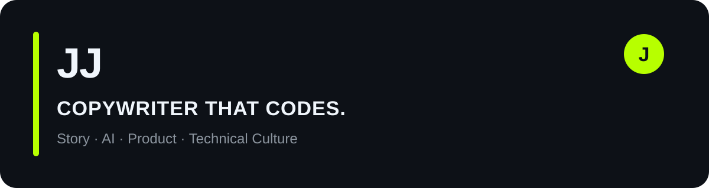

# Jonathan “JJ” James

**Creative systems person working where story, brand, AI, product, and technical culture overlap.**

I come from copywriting, advertising, production, and strategy. I build small systems, tools, and experiments that turn fuzzy problems into something people can use, test, or argue with.

[Website](https://damnjj.wtf) · [LinkedIn](https://www.linkedin.com/in/damnjj) · [Instagram](https://www.instagram.com/damnjj.wtf/) · [YouTube](https://www.youtube.com/@damnjjwtf) · [Email](mailto:jj@damnjj.wtf)

## ⚡ Now

- Showrunning **Sparks at GitHub Universe 2026**
- Building AI-native products and creative systems
- Exploring developer marketing, technical storytelling, and FDE-style problem solving
- Learning in public by shipping, testing, and tightening the loop

## Selected work

### [Gigsaw](https://github.com/Damnjjwtf/gigsaw)
**The system is the resume.** A ship-first career operations system for researching companies, finding real problems, designing proof builds, and applying with evidence instead of promises.

### [GenLens](https://github.com/Damnjjwtf/GenLens)
Daily intelligence for creative technologists working in AI-accelerated visual production. It collects, classifies, scores, and synthesizes signals across tools, workflows, research, hiring, cost, and culture.

### [Big World](https://github.com/Damnjjwtf/bigworld)
A local-first decision system for making beliefs explicit, testing competing hypotheses, preserving evidence provenance, and changing action when evidence changes the belief.

### [A Halloween Story: Structure Lab](https://github.com/Damnjjwtf/A-Halloween-Story)
A two-person structural invention system for feature-film development. Independent creative input, a library of story systems, AI synthesis, mutation, voting, and exportable structure candidates.

### [Critical Speculative Fiction](https://github.com/Damnjjwtf/critical-speculative-fiction)
A Claude skill that turns provocative “what if?” questions into believable near-future scenarios, fictional artifacts, and questions worth arguing about.

## What I’m useful for

`creative systems` · `AI workflows` · `technical storytelling` · `developer marketing` · `product experiments` · `research → prototype`

## Working principle

> **Show the work. Ship the proof.**

San Francisco · [damnjj.wtf](https://damnjj.wtf)
